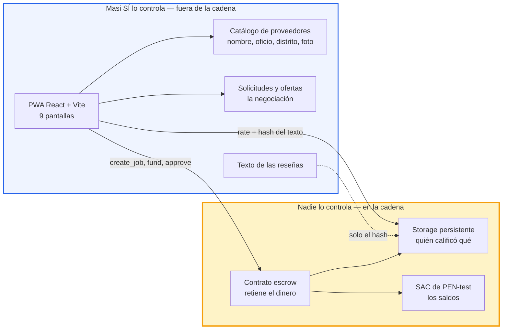
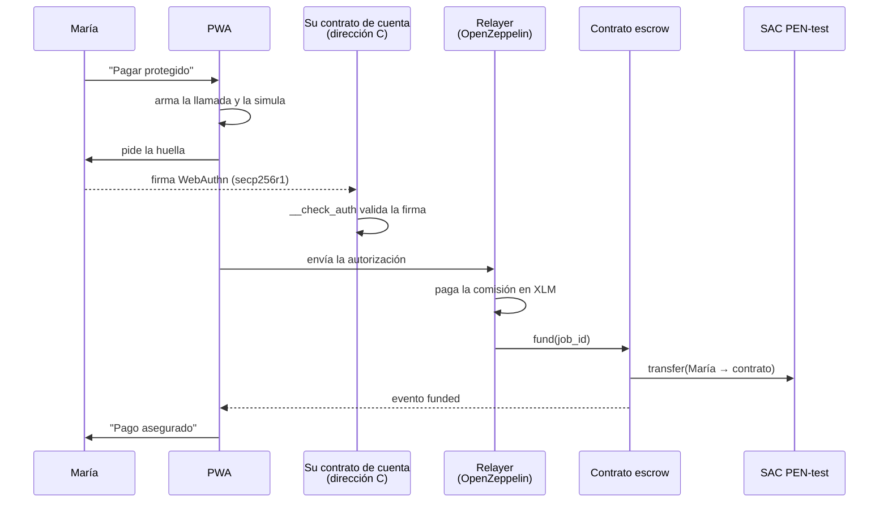
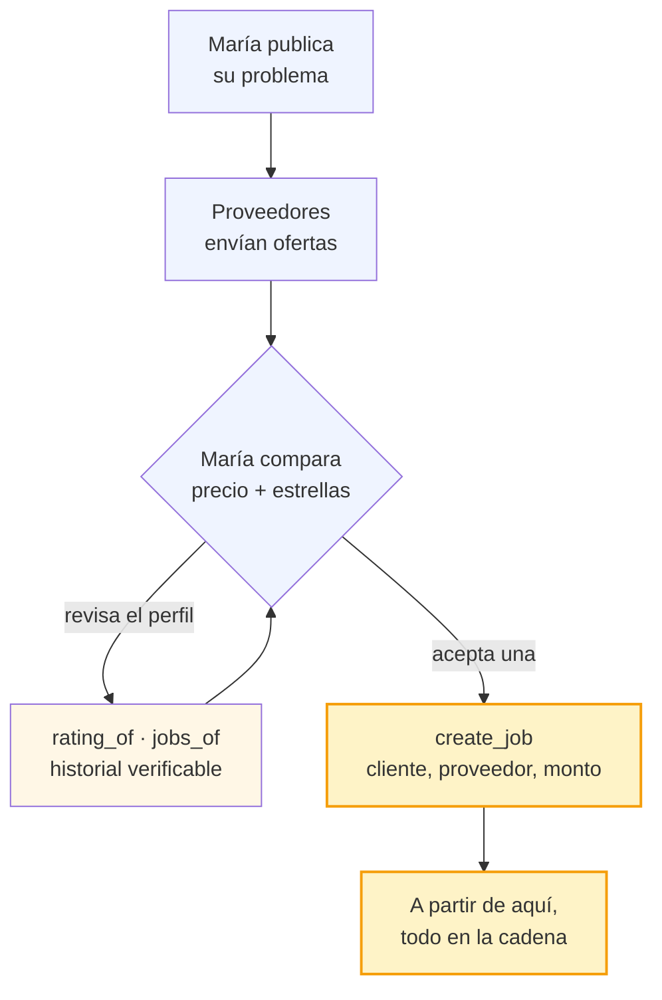
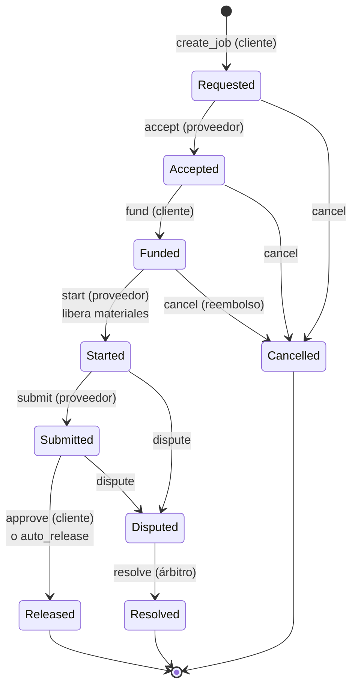

# Arquitectura

**Stellar Odyssey Perú 2026 · Track 6 · Open Build**

La idea que ordena todo lo demás: **casi todo Masi es una app normal**. Solo dos cosas viven en la cadena, y son exactamente las dos donde "confía en nosotros" es una respuesta débil.

---

## 1. La frontera de confianza

Lo que importa de este diagrama no son las cajas, sino la línea que las separa. A la izquierda, cosas que Masi puede cambiar. A la derecha, cosas que no.

**Por qué esas dos y no más:**

| En la cadena | Por qué una base de datos no alcanza |
|---|---|
| Retener el dinero | Si Masi lo guardara, estaría custodiando fondos de terceros: eso exige licencia de la SBS. El contrato lo retiene, así que Masi **no puede** cogerlo ni congelarlo |
| Quién calificó qué | `rate` solo lo puede llamar la dirección que pagó ese trabajo, una vez. Inventar una reseña obliga a contratar y pagar un trabajo real |

Todo lo demás —búsqueda, perfiles, ofertas, textos, fotos— está fuera porque una base de datos lo hace mejor, más rápido y más barato.

---

## 2. Cómo viaja una operación

El usuario nunca ve una wallet, nunca escribe una frase semilla y nunca necesita XLM. Esto es lo que ocurre cuando toca su huella:

Las tres piezas que hacen posible la promesa:

- **Passkey + contrato de cuenta.** La llave se crea con WebAuthn en el celular y vive protegida por la huella. La cuenta es un contrato que valida esa firma en `__check_auth`. Sin frase semilla.
- **Relayer.** Mete la autorización en una transacción y paga el XLM. Solo acepta llamadas a nuestro contrato y al SAC.
- **SAC.** El saldo de una dirección C vive en el storage del SAC, no en una trustline. Por eso los usuarios no necesitan abrir ninguna.

---

## 3. Del trato al contrato

La negociación es off-chain. Solo cuando María acepta una oferta entra la cadena.

Al contrato le da igual cómo se emparejaron: `create_job` recibe un proveedor y un monto. Por eso la subasta no obligó a cambiar ni una línea del contrato.

---

## 4. Los nueve estados

Tres reglas que el diagrama no muestra:

- **El adelanto de materiales no se puede disputar.** Una vez entregado en `start`, es del proveedor. Por eso está acotado al 50% como máximo: es el riesgo máximo del cliente.
- **`auto_release` cuenta desde `submit`**, no desde la creación. Si el proveedor nunca entrega, el cliente puede disputar.
- **Solo desde `Released` o `Resolved` se puede calificar**, una vez por trabajo.

---

## 5. Qué garantiza y qué no

**Garantiza:**

- Masi nunca custodia el dinero. Si Masi desaparece, el dinero sigue en el contrato y se libera igual.
- El proveedor cobra aunque el cliente no responda: `auto_release` lo puede disparar cualquiera, no hace falta que Masi ejecute nada.
- Una reseña solo la escribe quien pagó, una vez, y cualquiera lo comprueba en el explorador sin pedir permiso.

**No garantiza:**

- Que el trabajo esté bien hecho. Eso sigue siendo criterio humano: el árbitro es Masi y solo reparte el saldo.
- Que cliente y proveedor no se salten la plataforma. Es el riesgo normal de cualquier marketplace.
- La conversión a soles. Eso lo haría un anchor regulado vía SEP-24; Masi está del lado wallet y nunca toca soles.

---

## Estado de la implementación

| Pieza | Estado |
|---|---|
| Contrato `escrow` | Desplegado y verificado en testnet |
| `rate` e historial on-chain | Funcionando |
| `auto_release` | Verificado, disparado por un tercero |
| `dispute` / `resolve` | `NotImplemented` — primeros de la lista de recortes |
| Passkeys + contrato de cuenta | Funcionan en Android; pendiente el dominio definitivo |
| Relayer | Servicio verificado; falta integrarlo |
| Rampa a soles | Simulada, como dice el README |

IDs, hashes y cómo reproducirlo: [`DESPLIEGUE.md`](./DESPLIEGUE.md). Estado por frente: [`AVANCE.md`](./AVANCE.md).
