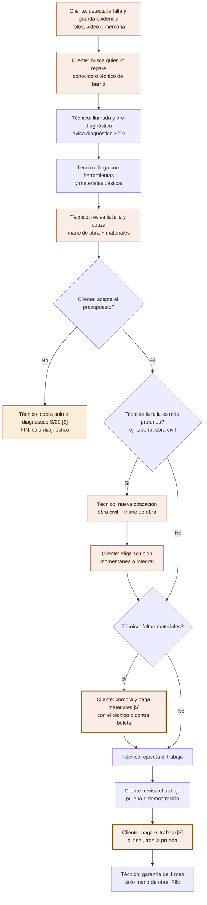
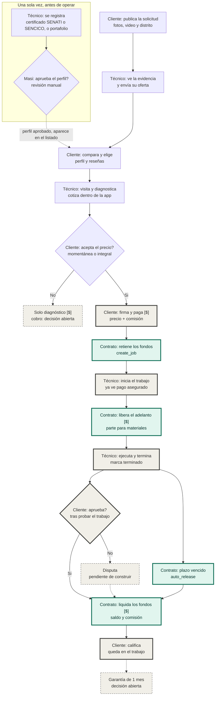

# MASI: flujos de proceso y diagnóstico de alcance

Documento del Product Owner para el TPO. Parte del proceso real que hoy siguen clientes y técnicos, y lo contrasta con el flujo contemplado para MASI en la hackathon Stellar Odyssey Perú. Se apoya en `AVANCE.md` del 20 de septiembre de 2026.

**Cómo leerlo.** Cada flujo tiene un diagrama Mermaid y, debajo, una tabla con los mismos pasos por si el diagrama no se renderiza en tu visor. La sección 8 son las preguntas que necesito que respondas.

---

## 1. Contexto y decisiones ya tomadas

- MASI es el rebrand de Kercado para la hackathon, sumando web3. El equipo es dueño de ambos.
- Investigación de Design Thinking: 12 entrevistas (5 técnicos y 7 usuarios), transcritas con NotebookLM. Las transcripciones las tiene el PO.
- Servicios cubiertos por Kercado: gasfitería, electricidad y cerrajería.
- Zona inicial (distritos A y B): Surco, Chorrillos, Barranco, Surquillo, Miraflores, San Isidro y San Borja.
- Captación de técnicos: solo personas con certificado de instituciones como SENATI o SENCICO, o con portafolio de trabajos. Deben registrarse y el equipo decide si el perfil pasa. En MASI podrán armar un portafolio para sus primeras interacciones.
- Benchmarking regional: las apps existentes fallan en inconformidades, cancelaciones y confianza con el técnico. Falta documentarlo con nombres de apps y enlaces (una de ellas está pendiente de confirmar).
- Decisión para materiales: **opción A, adelanto único** (sección 6).
- **No se mostrará el flujo completo en el demo.** Se propone mostrar en vivo solo el tramo con transacciones en Stellar (sección 3).

---

## 2. Proceso actual, sin tecnología

Este flujo sale de la descripción del PO. El orden entre "falla más profunda" y "faltan materiales" es su lectura y debe confirmarse con las transcripciones.

Leyenda: coral = fricción a validar. Ámbar = mueve dinero. Coral con borde grueso = ambas cosas.

| Id | Actor | Paso | Fricción | Dinero |
|---|---|---|---|---|
| A1 | Cliente | Detecta la falla y guarda evidencia (fotos, video o memoria) | Sí | |
| A2 | Cliente | Busca quién lo repare (conocido o técnico de barrio) | Sí | |
| A3 | Técnico | Llamada y pre-diagnóstico; avisa diagnóstico de S/20 | | |
| A4 | Técnico | Llega con herramientas y materiales básicos | | |
| A5 | Técnico | Revisa la falla y cotiza mano de obra y materiales | Sí | |
| A6 | Cliente | Decide si acepta el presupuesto. Si no, paga solo el diagnóstico y termina | | S/20 |
| A7 | Técnico | Detecta si la falla es más profunda (ej. tubería, obra civil) | | |
| A8 | Técnico | Nueva cotización con obra civil y mano de obra | Sí | |
| A9 | Cliente | Elige solución momentánea o integral | Sí | |
| A10 | Técnico | Verifica si faltan materiales | | |
| A11 | Cliente | Compra y paga materiales (con el técnico o contra boleta) | Sí | Sí |
| A12 | Técnico | Ejecuta el trabajo | | |
| A13 | Cliente | Revisa el trabajo (prueba o demostración) | | |
| A14 | Cliente | Paga el trabajo, al final | Sí | Sí |
| A15 | Técnico | Garantía de 1 mes, solo mano de obra | | |

### Fricciones (hipótesis a validar contra las 12 entrevistas)

1. **Evidencia sin estructura (A1).** Fotos, video o memoria; el técnico se forma una idea solo por llamada.
2. **Elección sin historial verificable (A2).** Se decide por cercanía: un conocido o el técnico de barrio.
3. **El precio aparece dentro de la casa (A5).** El cliente ya recibió al técnico y no compara. Su única salida es pagar el diagnóstico.
4. **Re-cotización con información desigual (A8, A9).** El cliente elige entre solución momentánea o integral sin poder verificar por qué subió el precio.
5. **Materiales sobre confianza (A11).** El dinero va y viene, ya sea acompañando al técnico o contra boleta.
6. **Pago al final, con la garantía como único respaldo (A14, A15).** No se sabe si la garantía tiene algún registro; confirmarlo en las entrevistas.

---

## 3. Flujo de MASI contemplado hasta ahora

Convenciones del diagrama:

- **Borde grueso**: tramo propuesto para mostrar en vivo (es una propuesta del PO, no una decisión cerrada).
- **Verde**: lo ejecuta el contrato en Stellar.
- **Punteado**: pendiente de construir o decisión abierta.
- **[$]**: mueve dinero.

Cada acción de cliente o técnico que cambia el estado del trabajo es una firma on-chain. Los cuadros verdes son lo que el contrato hace por sí mismo.

| Id | Actor | Paso | Tipo | Demo (propuesta) | Dinero |
|---|---|---|---|---|---|
| P1 | Técnico | Se registra con certificado o portafolio | Fuera de cadena | No | |
| P2 | Masi | Aprueba o rechaza el perfil (manual) | Fuera de cadena | No | |
| M1 | Cliente | Publica la solicitud con fotos, video y distrito | Fuera de cadena | No, simulado | |
| M2 | Técnico | Ve la evidencia y envía su oferta | Fuera de cadena | No, simulado | |
| M3 | Cliente | Compara ofertas y elige, viendo perfil y reseñas | Fuera de cadena | No, simulado | |
| M4 | Técnico | Visita, diagnostica y cotiza dentro de la app | Fuera de cadena | No, simulado | |
| M5 | Cliente | Acepta el precio (opción momentánea o integral) | Fuera de cadena | No | |
| M5N | Técnico | Solo diagnóstico | Decisión abierta | No | S/20 en el proceso actual |
| M6 | Cliente | Firma y paga precio más comisión | Firma on-chain | Sí | Sí |
| M7 | Contrato | Retiene los fondos (`create_job`) | Contrato | Sí | |
| M8 | Técnico | Inicia el trabajo y ve "pago asegurado" | Firma on-chain | Sí | |
| M9 | Contrato | Libera el adelanto de materiales | Contrato | Sí | Sí |
| M10 | Técnico | Ejecuta y marca "terminado" | Firma on-chain | Sí | |
| M11 | Cliente | Aprueba tras probar el trabajo | Firma on-chain | Sí | |
| M11b | Contrato | Plazo vencido, `auto_release` | Contrato | Sí | |
| M12 | Cliente o técnico | Disputa | Pendiente (`dispute` y `resolve` devuelven `NotImplemented`) | No | |
| M13 | Contrato | Liquida saldo y comisión | Contrato | Sí | Sí |
| M14 | Cliente | Califica, 1 a 5 estrellas (`rate`) | Firma on-chain | Sí | |
| M15 | Técnico | Garantía de 1 mes | Decisión abierta | No | |

---

## 4. Cambio clave respecto a AVANCE.md

**Cómo está en AVANCE.md:** el cliente compara ofertas y acepta una, lo que dispara `create_job` con un monto fijo.

**El problema:** en el proceso real, el precio se conoce **después de la visita**. Como la falla real muchas veces es otra, casi ninguna oferta previa sería el precio final. Y como el contrato guarda un monto fijo y el adelanto de materiales es irreversible una vez entregado, una oferta imprecisa no se puede corregir.

**Propuesta:** separar dos momentos.

1. Las **ofertas** sirven para elegir al técnico (M2 y M3).
2. El escrow nace con la **cotización final**, ya después de la visita (M4 y M5). `create_job` se llama entonces.

El contrato no debería cambiar (por confirmar, pregunta 2). Lo que cambia es qué significa "oferta" en la pantalla, y aparece un paso nuevo, la cotización final dentro de la app, que hoy no está en la lista de pendientes de `AVANCE.md`.

---

## 5. Seguimiento del valor

| Momento | Hoy, sin tecnología | MASI en el flujo actual | Quién carga el riesgo en MASI |
|---|---|---|---|
| Diagnóstico de S/20 | El cliente lo paga si no contrata | Decisión abierta, fuera del contrato | Sin definir |
| Materiales | El cliente paga en tienda o contra boleta; a veces el técnico adelanta | Adelanto retenido, liberado al iniciar | El cliente, si el técnico no termina (el adelanto es irreversible). El técnico, si los materiales superan el tope |
| Mano de obra | Al final, tras la prueba | Retenida desde el pago, liquidada al aprobar o al vencer el plazo | El cliente, mientras `dispute` no exista |
| Comisión | No existe | Se cobra en la liquidación. Ejemplo de AVANCE.md: S/1.260 = S/1.200 + S/60 (5 %), pagada por el cliente | El cliente |
| Reputación | Boca a boca | Portafolio inicial, luego reseñas atadas a pagos | Se puede inflar con trabajos falsos, y el costo es la comisión |
| Garantía de 1 mes | Existe, solo mano de obra | No existe | El cliente, que queda con menos protección que hoy |

---

## 6. Materiales: decisión y alternativas evaluadas

El PO estima que la mano de obra es poco más del 50 % del precio, es decir, los materiales quedan por debajo del 50 %. Es una estimación y varía por trabajo; hay que contrastarla con las entrevistas. `AVANCE.md` usa 30 % en el ejemplo y el contrato tiene un tope de `materials_bps` de 5.000 (50 %).

| | A. Adelanto único | B. Estilo Rappi Favores | C. Sin materiales en el escrow |
|---|---|---|---|
| Cómo funciona | La cotización final trae una línea "materiales a comprar". El cliente la ve antes de pagar y se libera al iniciar | Lista por producto, aprobación por ítem, boleta y devolución del sobrante | Precio total; el técnico pone los materiales y cobra todo al aprobar |
| Cambios al contrato | Probablemente ninguno | Nuevos: liberar contra aprobación, devolver sobrante, prueba de compra | Ninguno |
| Riesgo del técnico | Bajo | Bajo | Alto: adelanta su plata |
| Encaje con "keep it simple" | Alto | Bajo | Alto |
| Viable para el 25 | Sí | No | Sí |

**Decisión: A.** B pasa al pitch como siguiente paso ("prueba de compra"). C contradice el flujo real, donde a veces el cliente paga los materiales.

Por qué no copiar Rappi Favores tal cual: allá la tarjeta se limita a una tienda y un monto, lo que acota el riesgo. En MASI el dinero liberado al técnico va a una wallet común y no hay equivalente. Además, verificar boletas con fotos funciona sin Stellar, y sin `dispute` la boleta no tiene consecuencias.

Consecuencia de A: el porcentaje de adelanto debe **calcularse de cada cotización** (materiales a comprar dividido por el total) y no ser un valor fijo. Si los materiales superan el 50 %, el técnico pone la diferencia. El técnico podría inflar la línea de materiales; el cliente la ve antes de pagar, pero el gasto real no se verifica. Hay que decirlo en el README.

---

## 7. Estado del alcance según AVANCE.md del 20 de septiembre

Puede haber cambiado desde entonces. Por favor corrige lo que esté desactualizado.

| Tramo | Contrato | Pantalla |
|---|---|---|
| Registro y aprobación del técnico | No aplica (manual) | La entrada del proveedor es hoy un muro con un solo botón de vuelta |
| Solicitud | No aplica | "Nueva solicitud" existe |
| Ofertas, comparar y elegir | No aplica | Pendientes (enviar oferta, comparar y aceptar) |
| Visita y cotización final | No aplica | No aparece en AVANCE.md; es nuevo |
| Pagar, iniciar, terminar, aprobar, calificar | Verificado en testnet | Pendientes |
| `auto_release` | Verificado (rechaza antes del plazo, libera después) | Pendiente |
| Disputa | `NotImplemented` | No existe |
| Garantía | No existe | No existe |

---

## 8. Preguntas para el TPO

1. **¿Dónde viven las solicitudes, las ofertas y la lista "mis trabajos"?** `dataSource.ts` cubre el contrato, pero la solicitud y las ofertas ocurren antes de que exista el trabajo. Si hoy son datos locales falsos, lo que publica un usuario no se ve en el teléfono del otro.
2. **¿`create_job` puede dispararse con la cotización final,** dejando las ofertas iniciales fuera del contrato?
3. **¿Qué pasa hoy si cliente y técnico acuerdan un monto distinto después de crear el trabajo?** Incluye el caso de un hallazgo imprevisto en plena obra, con monto fijo y adelanto ya entregado.
4. **¿El contrato acepta un trabajo pequeño, como un diagnóstico, con materiales en cero?**
5. **¿`materials_bps` se puede fijar por trabajo a partir de la cotización?** ¿Qué ocurre si los materiales superan el 50 %?
6. **`auto_release`: ¿a quién libera?** El PO asume que al técnico. Si es así, y sin `dispute`, el cliente no tiene forma de frenarlo cuando no aprueba.
7. **¿Cuánto costaría un `dispute` mínimo** (congelar los fondos y que una llave de Masi los reparta con `resolve`)? El PO considera que no debería ser lo primero en recortarse.
8. **¿Cómo se hace el demo con dos roles** (dos dispositivos o dos perfiles del navegador)?
9. **Reseñas: ¿dónde se guarda el texto del comentario?** En cadena solo queda el hash.
10. **Nombres exactos de las funciones on-chain** de pagar, iniciar, terminar y aprobar, para etiquetar los diagramas. Aquí usé nombres genéricos salvo `create_job`, `auto_release`, `rate`, `dispute` y `resolve`.

---

## 9. Decisiones abiertas del PO

- **Diagnóstico de S/20:** ¿siempre se cobra o solo si el cliente no contrata? ¿Pasa por el contrato o queda fuera? Propuesta: fuera del alcance del demo.
- **Garantía de 1 mes:** ¿mecanismo mínimo o siguiente paso con respuesta preparada para el jurado?
- **Verificación de identidad y antecedentes del técnico,** más allá del certificado o portafolio (con revisión legal de datos personales).
- **Tramo del demo:** confirmar el borde grueso propuesto.
- **Modelo de ingreso:** Kercado planteaba tarifa plana por servicio y luego comisión; MASI usa comisión del 5 % en el ejemplo. Definir cuál se presenta.
- **Track de la hackathon** en el que se inscribe MASI.

---

## 10. Supuestos y límites de este documento

- El orden de los pasos del proceso actual es la lectura del PO y falta contrastarlo con las transcripciones.
- Las fricciones son hipótesis hasta que se respalden con citas de las entrevistas.
- El borde grueso del demo es una propuesta.
- El estado del alcance es el de `AVANCE.md` del 20 de septiembre.
- El porcentaje de mano de obra (poco más del 50 %) es una estimación del PO, sin cifras de las entrevistas.
- No se verificó el benchmarking con apps regionales; falta documentarlo con nombres y enlaces.
