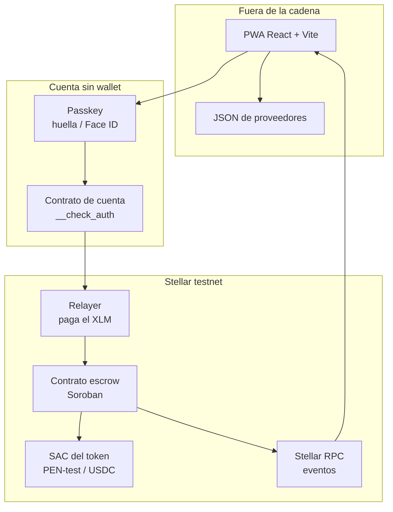
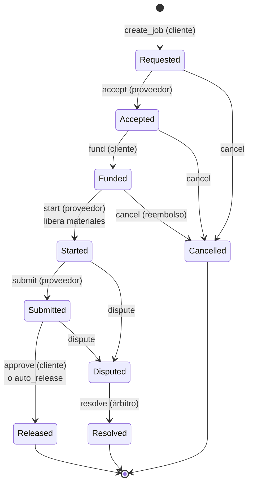
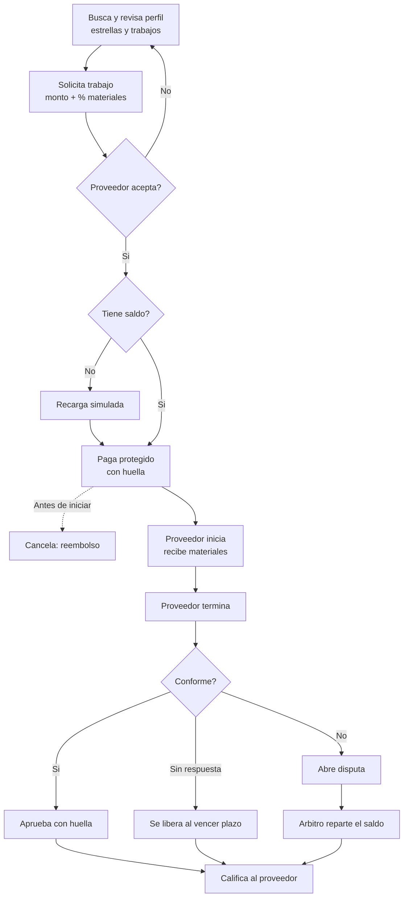

# Masi — Scope Stellar Odyssey Perú 2026

2026-09-19

## Resumen

Masi es un marketplace de servicios donde todo pago va protegido: el cliente bloquea el dinero en un contrato Soroban, el trabajador recibe un adelanto para materiales al empezar y el saldo al aprobar. Las calificaciones solo las puede dejar quien pagó por el contrato, así que no se pueden inventar gratis.

**Caso del demo:** María busca un pintor en Surco, elige a Juan y acuerdan pintar su departamento por S/1,200, con 30% para materiales.

**Por qué el trabajador lo adopta:** porque el marketplace le trae clientes y la regla de la plataforma es que todo trabajo va con pago protegido. A cambio, recibe adelanto garantizado para materiales, un precio que no se renegocia y cobro automático si el cliente no responde.

**Tesis:** un marketplace de servicios que no custodia dinero y cuyas calificaciones están respaldadas por pagos reales.

**Track:** 6 · Open Build (inscripción confirmada).

## Dónde entra Stellar

Stellar se usa solo donde una base de datos no alcanza: retener el dinero sin que Masi lo custodie y guardar reseñas que Masi no pueda editar. Todo lo demás (búsqueda, perfiles, textos) vive fuera de la cadena.



| Pieza de Stellar | Dónde se usa en Masi | Por qué no basta una base de datos |
| --- | --- | --- |
| Contrato Soroban `escrow` | `fund`, `start`, `approve`, `auto_release`, `resolve` | El dinero lo retiene el contrato, no Masi: no hay custodia de fondos de terceros |
| Almacenamiento persistente | `rate`, `jobs_of`, `rating_of` | Reseñas e historial que Masi no puede borrar ni inventar |
| SAC + token | Todo movimiento de dinero (PEN-test en el demo, USDC en producción) | Dinero programable: el reparto materiales / saldo / comisión ocurre en la misma transacción |
| Passkeys (secp256r1) + contrato de cuenta | Pagar y aprobar con huella | Sin wallet, sin frase semilla |
| Relayer | Todas las escrituras | El usuario nunca necesita XLM |
| Eventos + Stellar RPC | Estado en vivo de cliente y proveedor | Actualizaciones sin backend propio |
| Explorador (stellar.expert) | Links desde el perfil y el README | Cualquiera verifica un pago sin pedirle permiso a Masi |
| Rampa (solo producción) | Recarga y cobro en soles | Un anchor vía SEP-24, autenticando cuentas de contrato con SEP-45; en el demo se simula |

**Frase para el README:** usamos blockchain porque el dinero y las reseñas no pueden quedar bajo el control de la plataforma, y Stellar porque tiene stablecoins nativas, rampas a dinero real y passkeys. **El pago se libera al instante**; la conversión a soles depende de la rampa.

## Flujo y estados

El trabajo pasa por 9 estados. El cliente inicia, porque es quien busca en el marketplace; el proveedor acepta el precio antes de que se bloquee el dinero.



Solo desde `Released` o `Resolved` el cliente puede calificar, una vez por trabajo.

## Flujo del cliente

El cliente toca la huella en dos momentos: al pagar y al aprobar; todo lo demás es navegación.



Las tres salidas de la revisión (aprobar, no responder, disputar) terminan en la calificación, porque `rate` está permitido en `Released` y `Resolved`.

## Contrato `escrow`

Un solo contrato Soroban maneja pagos, calificaciones e historial. El token es PEN-test (activo de prueba con su SAC).

| Función | Quién | Estado requerido | Qué hace |
| --- | --- | --- | --- |
| `__constructor(admin)` | despliegue | — | Fija el administrador en el mismo acto del despliegue |
| `init(arbiter, platform, token)` | admin | — | Configura árbitro, cuenta de comisiones y token; una sola vez |
| `create_job(client, provider, amount, materials_bps, fee_bps, review_secs, description)` | cliente | — | Crea el trabajo en `Requested` y devuelve `job_id` |
| `accept(job_id)` | proveedor | Requested | Acepta el precio |
| `fund(job_id)` | cliente | Accepted | Bloquea `amount` + comisión (la comisión la paga el cliente) |
| `start(job_id)` | proveedor | Funded | Transfiere `amount × materials_bps` al proveedor |
| `submit(job_id)` | proveedor | Started | Marca terminado y guarda `submitted_at` |
| `approve(job_id)` | cliente | Submitted | Saldo al proveedor, comisión a la plataforma |
| `auto_release(job_id, caller)` | cualquiera | Submitted y pasó `review_secs` | Igual que `approve` |
| `cancel(job_id, caller)` | cliente o proveedor | Requested, Accepted o Funded | Reembolso completo si estaba fondeado |
| `dispute(job_id, caller)` | cliente o proveedor | Started o Submitted | Congela el saldo |
| `resolve(job_id, provider_bps)` | árbitro | Disputed | Reparte solo el saldo; la comisión va a la plataforma |
| `rate(job_id, stars, comment_hash)` | cliente | Released o Resolved | 1–5 estrellas, una vez por trabajo |
| `get_job(job_id)` | lectura | — | Datos y estado del trabajo |
| `jobs_of(provider)` | lectura | — | Lista de trabajos del proveedor |
| `rating_of(provider)` | lectura | — | Suma y cantidad de calificaciones, trabajos completados y disputas |

**Reglas clave**

- El adelanto para materiales no se puede disputar: una vez entregado, es del proveedor. El riesgo máximo del cliente queda acotado a ese porcentaje.
- `auto_release` corre desde `submit`, no desde la creación. Si el proveedor nunca envía, el cliente puede disputar.
- Cada función de escritura exige `require_auth` del rol indicado.
- **Las funciones que admiten más de un rol reciben `caller` como parámetro.** `cancel`, `dispute` y `auto_release` no pueden deducir a quién exigirle la firma, así que quien llama se identifica y el contrato comprueba que sea parte del trabajo. Es la única forma de que `require_auth` signifique algo cuando el rol no es único.
- **`materials_bps` no puede pasar de 5.000 y `fee_bps` no puede pasar de 1.000.** El adelanto es irreversible una vez entregado, así que el tope es lo que hace cierta la regla de que el riesgo del cliente queda acotado; y como la comisión la paga el cliente por encima del precio, sin tope podría duplicar el cobro.

**Calificaciones on-chain:** solo el cliente de un trabajo pagado puede calificar, una vez. El comentario se guarda fuera de la cadena y en el contrato queda su hash, para que no se pueda editar después. Inventar una reseña cuesta la comisión de un trabajo real.

**Almacenamiento:** trabajos, lista por proveedor y calificaciones en almacenamiento persistente, extendiendo el TTL en cada escritura. No depender de eventos del RPC para el historial, porque solo se guardan por un tiempo limitado.

**Eventos:** `requested`, `accepted`, `funded`, `started`, `submitted`, `released`, `disputed`, `resolved`, `cancelled`, `rated`. Sirven para actualizar la interfaz en vivo.

### PEN-test y direcciones C

Nuestros usuarios tienen **direcciones C** (contratos de cuenta con passkey), no las direcciones G clásicas. Eso cambia cómo se les acredita saldo, y es el error más fácil de cometer copiando un tutorial de pagos clásicos.

**No necesitan trustline.** La documentación lo dice explícito: *"Using `Address::Contract`: the balance and authorization state will be stored in contract storage, as opposed to a trustline"* ([Stellar Asset Contract](https://developers.stellar.org/docs/tokens/stellar-asset-contract)). El saldo vive dentro del SAC.

La cuenta emisora de PEN-test es, por defecto, la administradora del SAC, así que la recarga es un `mint` directo a la dirección C:

```bash
# Desplegar el SAC del activo (una sola vez)
stellar contract asset deploy \
  --asset PENT:<G_DEL_EMISOR> \
  --source-account masi-issuer --network testnet

# Acreditar S/1,200 a un usuario (7 decimales → stroops)
stellar contract invoke \
  --id <SAC_ID> --source-account masi-issuer --network testnet \
  -- mint --to <C_DEL_USUARIO> --amount 12000000000
```

- **No poner `AUTH_REQUIRED` al PEN-test.** Con esa bandera cada transferencia exige autorización explícita y complica el escrow sin aportar nada al demo.
- La función `trust()` del SAC **es un no-op para direcciones C**; solo sirve para receptores G. Si aparece en un ejemplo copiado, sobra.
- Para direcciones de contrato los saldos son `i128` (no los `i64` de las trustlines), que es lo que ya usa el escrow.
- **Prior art:** el flujo de [Embedded Wallets del Stellar Disbursement Platform](https://developers.stellar.org/docs/platforms/stellar-disbursement-platform/admin-guide/embedded-wallets) es exactamente este patrón — transferencia SAC a una wallet de contrato, con la comisión patrocinada y el receptor sin pagar nada. Vale la pena que P1 y P2 lo lean.

## Frontend y marketplace

React + Vite, una PWA con cinco pantallas. El marketplace es mínimo: lo que importa del demo es que el perfil y las calificaciones salen del contrato.

| Pantalla | Usuario | Contenido | Fuente de datos |
| --- | --- | --- | --- |
| Búsqueda | cliente | Filtro por oficio y distrito, tarjetas con estrellas y trabajos completados | JSON de proveedores + `rating_of` |
| Perfil del proveedor | público | Datos, promedio de estrellas, reseñas, trabajos pagados con link al explorador, botón "Solicitar trabajo" | JSON + `jobs_of`, `rating_of`, `get_job` |
| Trabajo (cliente) | cliente | Solicitar, pagar protegido, aprobar, disputar, calificar | contrato + eventos |
| Trabajo (proveedor) | proveedor | Aceptar, ver "Pago asegurado", iniciar, terminar | contrato + eventos |
| Recargar (simulado) | cliente | Pantalla al estilo Yape: QR dibujado, "Confirmando pago…", dos segundos, saldo acreditado. Rotulada como simulación | `mint` del SAC, firmado por la cuenta emisora |

**Datos precargados:** 8 proveedores de prueba (nombre, oficio, distrito, precio referencial, foto genérica) en un JSON. Antes de grabar el video se ejecutan 3 o 4 trabajos reales en testnet para que los perfiles tengan historial y calificaciones on-chain.

**Recarga simulada — caja de tiempo: 30 minutos.** Sin integrar ningún proveedor: el QR es un dibujo, la espera es un `setTimeout` y por debajo corre el mismo `mint` del SAC. Se descartó integrar Coinbase Onramp (pide `APP_ID` y dirección de destino, en sandbox el dinero es igual de falso, y por defecto liquida en Base y no en Stellar). La recarga **no aparece en ninguna de las 7 escenas del video**: si el 22 aprieta el tiempo, esta pantalla se recorta antes que cualquier otra cosa.

**Montos:** siempre en soles en la interfaz. Nunca aparecen las palabras wallet, XLM, gas ni seed phrase.

## Passkeys y relayer

Se intentan con una prueba de 3 horas el 20 de septiembre; si el 22 en la noche no firman una transacción de punta a punta, se pasa al fallback.

1. **Registro:** WebAuthn crea una llave secp256r1 en el celular, desbloqueada con huella o Face ID.
2. **Cuenta:** se despliega un contrato de cuenta (dirección C) que guarda la llave pública y valida firmas en `__check_auth`.
3. **Cada acción:** la app arma la llamada, la simula y el usuario firma la autorización con la huella.
4. **Envío:** el relayer mete la autorización en una transacción, paga el XLM y la envía. Solo acepta llamadas a nuestro contrato y al SAC de PEN-test.

**Condiciones:** HTTPS y dominio definitivo desde el día 1 (la passkey queda atada al dominio exacto). Se hostea en Vercel, que da HTTPS automático: `https://masiapp.vercel.app` no se renombra nunca, porque al cambiarlo las cuentas creadas antes dejan de entrar. Se prueba siempre en la URL principal, nunca en un deploy preview (`masiapp-git-…vercel.app`), que es otro origen. El dominio tiene que estar fijo **antes** de sembrar los trabajos del 24. En `localhost` las passkeys funcionan sin HTTPS, así que el riesgo aparece recién al pasar al celular.

**Pendiente de verificar hoy:** cuál de las dos librerías hermanas usar — [`passkey-kit`](https://github.com/stellar/passkey-kit) (modelo de firmantes plano) o [`smart-account-kit`](https://github.com/stellar/smart-account-kit) (context rules de OpenZeppelin sobre la cuenta auditada de `stellar-contracts`). **No son intercambiables:** usan modelos de autorización on-chain distintos, así que cambiar de una a otra después obliga a rehacer el contrato de cuenta. Para Masi basta el modelo plano; `smart-account-kit` solo se justifica si hiciera falta límites de gasto o umbrales. Verificar además que el ejemplo corra en testnet y que el relayer esté operativo: el [OpenZeppelin Relayer](https://docs.openzeppelin.com/relayer/stellar) reemplazó al Launchtube deprecado y tiene instancia hosteada de testnet en `https://channels.openzeppelin.com/testnet` (API keys en `/gen`).

**Fallback, en orden:**

1. **Blux** ([blux.cc](https://blux.cc), [github.com/bluxcc/core](https://github.com/bluxcc/core)): connect kit para dApps Stellar con registro por Google/OAuth, email o teléfono. El usuario toca "Registrarse con Google" y queda con cuenta; la promesa de "sin wallet, sin frase semilla" se mantiene. Es cambio solo de frontend: el contrato, las reseñas on-chain y el relayer no se tocan. Financiado por SCF ronda 36 ($54k), repo activo (último commit 2026-09-13).
2. Freighter.

**Por qué las passkeys siguen siendo la opción principal:** son un solo toque, sin salir de la app, y la passkey ya se respalda en la cuenta de Google o iCloud del usuario — es el mismo beneficio que un botón de Google, con menos fricción. Blux solo entra si el 22 en la noche las passkeys no firman de punta a punta.

**A verificar antes de adoptar Blux** (30 min en la ventana de P2): que el paquete esté publicado y el ejemplo corra en testnet; que el flujo OAuth devuelva una dirección Stellar que firme; **si la llave es no-custodial y cómo se recupera** (va al README); y si la cuenta resultante es G-address, quién paga la reserva de 1 XLM — en testnet es friendbot, en producción es un costo por usuario que hay que declarar como limitación.

## Fuera del alcance

Nada de esto se construye esta semana, aunque sobre tiempo: chat, registro de proveedores, panel de administración, notificaciones, mapas o geolocalización, fotos de evidencia, calificaciones del proveedor al cliente, integración real con un anchor, path payments, pagos por varios hitos y cualquier producto de crédito.

**Explícitamente prohibido:** levantar el Anchor Platform. Ese software lo corre el anchor —la empresa con licencia, cuentas bancarias y KYC—, no la app. Masi está del lado wallet y solo *consumiría* un anchor por SEP-24. Sin licencia de la SBS no mueve un sol, así que intentarlo cuesta un día y no produce nada.

**Prior art que confirma esto:** [pagame-pe](https://github.com/lothesito/pagame-pe) (equipo peruano, mayo 2026) sí levantó el Anchor Platform: Docker + Postgres, SEP-12/31/38 habilitados y un business server completo con cinco archivos de rutas. El banco, al final de toda esa cadena, sigue siendo un `setTimeout` de dos segundos (`BANK_API_SIMULATOR_DELAY`) que responde "ya deposité"; el on-ramp es Coinbase en sandbox liquidando en Base, no en Stellar; y el tipo de cambio es un `3.75` escrito a mano. Meses de trabajo para llegar al mismo botón simulado. Además **no tienen ningún contrato Soroban**: toda su lógica vive en un servidor que controlan. Esa es justamente la diferencia que Masi sí tiene y la que el track Open Build mira.

## Equipo y cronograma

Cuatro frentes en paralelo desde el 20; el único punto de integración crítico es el 22, cuando el contrato desplegado se conecta con las passkeys.

| Persona | Frente | Responsable de |
| --- | --- | --- |
| P1 | Contrato | `escrow` en Rust, tests, despliegue, token PEN-test y SAC |
| P2 | Cuentas | Prueba de passkeys, contrato de cuenta, relayer, fallback |
| P3 | Marketplace | JSON de proveedores, búsqueda, perfil, calificaciones en la interfaz |
| P4 | Flujo e integración | Pantallas de cliente y proveedor, stellar-sdk, eventos; lidera README y video |

| Fecha | P1 Contrato | P2 Cuentas | P3 Marketplace | P4 Flujo |
| --- | --- | --- | --- | --- |
| 20 sept | Estados y funciones principales | Prueba de 3 h + elegir librería | JSON y búsqueda con datos falsos | Pantallas del flujo con datos falsos |
| 21 sept | Disputa, rate, tests; despliegue en testnet | Contrato de cuenta y relayer | Perfil y reseñas con datos falsos | Conectar con el contrato desplegado |
| 22 sept | Flujo completo por CLI | Integrar firma con huella; decisión de fallback en la noche | Conectar perfil con `jobs_of` y `rating_of` | Recarga simulada y eventos en vivo |
| **23 sept** | **Checkpoint:** contract ID e interfaz | Diagrama de arquitectura | Repo ordenado | Entrega del checkpoint |
| 24 sept | Correcciones y soporte | Pulir el flujo en el celular | Pulir el marketplace | Integración completa, sembrar 3–4 trabajos reales |
| 25 sept | Hashes para el README | Pruebas en dos celulares | Capturas | README y video |

## Recortes, riesgos y limitaciones

Si falta tiempo se recorta en este orden: disputa y `resolve` → passkeys (pasar al fallback) → comentarios de las reseñas (quedan solo estrellas) → búsqueda (queda una lista). **Nunca se recortan** el flujo principal con adelanto para materiales, `auto_release`, `rate` y el perfil con historial on-chain.

| Riesgo | Mitigación |
| --- | --- |
| Passkeys no funcionan a tiempo | Prueba el 20, decisión el 22, fallback definido |
| Integración tardía entre frentes | Contrato desplegado el 21; frontend con datos falsos hasta entonces |
| Perfiles vacíos en el video | Sembrar 3–4 trabajos reales en testnet el 24 |
| Cliente y proveedor se saltan la plataforma | Riesgo normal de marketplace; se menciona en el README |

**Limitaciones que el README dice explícitamente**

- La recarga es simulada. En producción la haría un anchor vía **SEP-24** (el usuario paga en soles por Yape o transferencia en la ventana del anchor y recibe el saldo), autenticando nuestras cuentas de contrato con **SEP-45** — el estándar para direcciones C que el [Anchor Platform](https://developers.stellar.org/docs/platforms/anchor-platform) de SDF ya soporta. Masi nunca toca soles, y por eso no necesita licencia. Candidatos: **MoneyGram Ramps** (API sobre Stellar + USDC, 30+ países para depósito y 170+ para retiro, lanzada en mayo 2025) y **Anclap**, que emitió la primera stablecoin del sol peruano sobre Stellar ([CoinDesk, sept 2021](https://www.coindesk.com/business/2021/09/28/stablecoin-pegged-to-perus-currency-launches-on-stellar)). **Sin verificar:** que MoneyGram cubra Perú (los países de LatAm nombrados son El Salvador y Colombia) y que la PEN de Anclap siga activa. No construimos nada de esto: el Anchor Platform lo corre el anchor, no nosotros.
- Las calificaciones se pueden falsear, pero cada reseña falsa cuesta la comisión de un trabajo real.
- Las comisiones en XLM y el alquiler del almacenamiento los paga Masi vía el relayer; se cubren con la comisión.
- Recuperación de cuenta: depende de la sincronización de passkeys con Google o iCloud.
- El árbitro es Masi; sus decisiones son públicas y solo afectan el saldo.

## Demo y checkpoint

El video dura 3 minutos y muestra en pantalla cada transacción con su hash.

| Tiempo | Escena |
| --- | --- |
| 25 s | María busca "pintor en Surco" y ve el perfil de Juan: estrellas y trabajos verificables |
| 30 s | Solicita el trabajo; Juan acepta S/1,200; María paga protegido con su huella |
| 25 s | Juan ve "Pago asegurado", inicia y recibe S/360 para materiales |
| 35 s | Juan termina; María aprueba: saldo a Juan y comisión a Masi |
| 20 s | María califica con 5 estrellas y el perfil de Juan se actualiza |
| 25 s | Segundo caso: el cliente no responde y el saldo se libera solo |
| 20 s | Hashes en el explorador de testnet |

**Checkpoint del 23**

- [ ] Diagrama de arquitectura
- [ ] Interfaz del contrato (la tabla de funciones de este documento)
- [ ] Repo público con README inicial
- [ ] Contract ID en testnet
- [ ] Decisión tomada sobre passkeys o fallback
